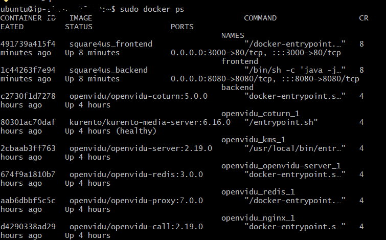
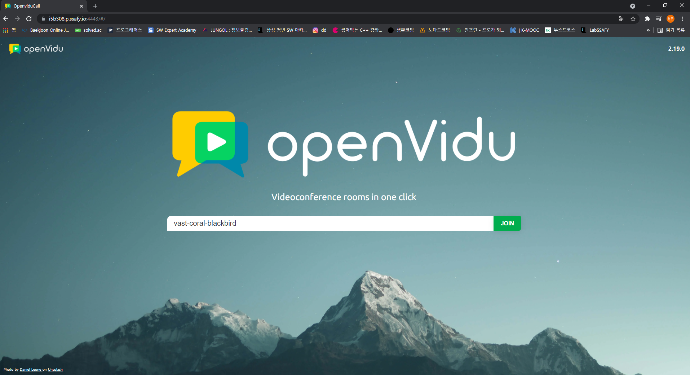

# 📑Square 4 Us

<br>

## 📎 목차


- [📑Square 4 Us](#square-4-us)
  - [📎 목차](#-목차)
  - [👩‍💻 프로젝트 소개](#-프로젝트-소개)
  - [📚 프로젝트 명세](#-프로젝트-명세)
    - [🎈개발 환경](#개발-환경)
      - [Front-end](#front-end)
      - [Back-end](#back-end)
      - [Design](#design)
      - [Commit Convention](#commit-convention)
    - [🎡 프로젝트 구조](#-프로젝트-구조)
    - [🎃 배포 방법](#-배포-방법)
        - [시스템 아키텍쳐](#시스템-아키텍쳐)
        - [🍙 포트 번호](#-포트-번호)
      - [🤖 프론트엔드 & 백엔드](#-프론트엔드--백엔드)
        - [docker compose](#docker-compose)
        - [프론트엔드 Dockerfile](#프론트엔드-dockerfile)
        - [백엔드 Dockerfile](#백엔드-dockerfile)
      - [🛢 DB](#-db)
      - [🧔🏻 Jenkins](#-jenkins)
        - [Jenkinsfile](#jenkinsfile)
      - [🧶 Nginx](#-nginx)
  - [:tv: WebRTC: Openvidu-Server 구축 과정](#tv-webrtc-openvidu-server-구축-과정)
    - [Openvidu Install](#openvidu-install)
    - [📚 핵심 라이브러리](#-핵심-라이브러리)

<br>

## 👩‍💻 프로젝트 소개

Square 4 Us는 스터디를 찾고, 운영하고, 활동하길 원하는 많은 사람들에게 Ontact 스터디 관리 서비스를 제공하는 **온라인 스터디 플랫폼**입니다.

<br>

## 📚 프로젝트 명세

- __URL__ : https://i5b308.p.ssafy.io/
- __배포 여부__ : O
- __접속 가능__ : O
- __HTTPS 적용__ : O
- __PORT__ : 443
  <br>

<!-- </details> -->

<details>
<summary>E-R Diagram</summary>


</details>


<details>
<summary>와이어 프레임</summary>

https://www.figma.com/file/Cq8wRgZiDYmEuX8snuic1S/Untitled?node-id=0%3A1
</details>

<details>
<summary>Swagger API Document</summary>

</details>

<br>

### 🎈개발 환경

|이름|역할|세부|
|----|----|----|
|김준영|팀원|프론트엔드 개발, CI/CD(배포) 담당자|
|윤이진|팀장|백엔드 개발, QA(Jira 관리)|
|천수승|팀원|프론트엔드 개발, UCC 담당자|
|최경운|팀원|백엔드 개발, AWS 담당자|

<br>

#### Front-end

- __Framework__ : Vue.js
- __지원 환경__ : Web
- __담당자__ : 김준영, 천수승
  <br>

#### Back-end

- __Framework__ : Spring Boot, JPA,  AWS S3,  Openvidu Media Server
- __File Server__ : AWS S3
- __Database__ : MySQL
- __담당자__ : 윤이진, 최경운, 김준영
  <br>

#### Design

- __Framework 사용__ : X
- __Design Tool 사용__ : X
- __담당자__ : 천수승, 김준영
  <br>

#### Commit Convention

> #Jira Issue Number [type]: commit message

  <br>

### 🎡 프로젝트 구조


<br>

### 🎃 배포 방법

##### 시스템 아키텍쳐


<br>

##### 🍙 포트 번호
    FrontEnd: 443(3000)
    BackEnd: 8080
    Openvidu: 4443
    Kurento-Media-Server: 8888
    Database: 3306


> 프론트엔드 & 백엔드 : Docker-Compose로 구성
>
> DB : 사전에 만들어 둔 DockerImage로 구성
>
> Jenkins : 어플리케이션과 별도의 Docker-Compose로 구성
>
> Openvidu : Docker run으로 구성


<br>


#### 🤖 프론트엔드 & 백엔드

<!-- ##### docker-compose.yml -->

##### docker compose

> 프론트엔드와 백엔드 각각의 Dockerfile을 참조해서 빌드하고, 배포하도록 구성했습니다

<details>

<summary> docker-compose.yml</summary>


```yaml
version: "3.9"
services: 
  frontend:
    container_name: frontend
    build: 
      context: ./frontend
    ports: 
      - 3000:80
    networks:
      - square4us
    restart: unless-stopped
    depends_on:
      - backend
  backend:
    container_name: backend
    build: 
      context: ./backend
    ports: 
      - 8080:8080
    networks:
      - square4us
    restart: unless-stopped
    
networks: 
  square4us:
```


</details>

<br>

##### 프론트엔드 Dockerfile

> 빌드용 이미지와 배포용 이미지를 분리해 이미지 크기를 줄였습니다.

<details>

<summary> dockerfile </summary>


```dockerfile
# 1. 빌드용 이미지
FROM node:12 AS build
WORKDIR /app
COPY package* ./
RUN npm install
COPY public ./public 
COPY src ./src
COPY .env* ./
RUN npm run build

# 2. 빌드 된 파일을 배포용 이미지에 복사
FROM nginx:alpine
COPY --from=build /app/dist /usr/share/nginx/html
```

</details>

<br>

##### 백엔드 Dockerfile

> 빌드된 파일을 실행하는데에는 JRE만 필요해, 배포 이미지는 JRE를 사용했습니다.

<details>

<summary> dockerfile </summary>

```dockerfile
# 1. 빌드용 이미지
FROM openjdk:8 AS build
WORKDIR /app
COPY gradlew .
COPY gradle gradle
COPY build.gradle .
COPY settings.gradle .
COPY src src
RUN chmod +x gradlew
RUN ["./gradlew", "clean", "build", "--stacktrace", "--exclude-task", "test"]

# 2. 빌드 된 파일을 배포용 이미지에 복사
FROM openjdk:8-jre-slim
COPY --from=build /app/build/libs/*.jar app.jar
EXPOSE 8080
ENTRYPOINT java -jar app.jar
```

</details>

<br>


#### 🛢 DB

> 한글이 깨지지 않도록 utf8 설정을 적용한 Docker image를 만들어 Docker hub에 업로드 후 배포했습니다.


<details>

<summary> run 커멘드 </summary>

```bash
docker run -dp 3306:3306 
--network app-network --network-alias mysql 
-v /var/lib/mysql:/var/lib/mysql
-e MYSQL_ROOT_PASSWORD=<Password>
-e MYSQL_DATABASE=<DB name>
wns312/mysql-utf8 # 아래 Dockerfile로 빌드한 이미지
--character-set-server=utf8mb4 --collation-server=utf8mb4_unicode_ci
```

</details>

<br>

<details>

<summary> Dockerfile </summary>

```dockerfile
FROM mysql:8.0.26
COPY utf8.cnf /etc/mysql/conf.d/
```

</details>

<details>

<summary> utf8.cnf </summary>

```cnf
[client]
default-character-set = utf8mb4

[mysqld] 
init_connect = SET collation_connection = utf8_general_ci 
init_connect = SET NAMES utf8
character-set-server = utf8mb4
collation-server = utf8_general_ci 

[mysqldump]
default-character-set = utf8mb4

[mysql]
default-character-set = utf8mb4
```

</details>

<br>

#### 🧔🏻 Jenkins

> 마찬가지로 Docker 이미지로 구성했습니다. Jenkins 이미지에는 Docker와 Docker-compose를 설치해 CLI로 사용할 수 있도록 빌드해 Docker hub에 올린 뒤 실행했습니다.
>
> 실제 docker와 docker-compose 커멘드를 실행할 경우 볼륨 연결로 호스트에 있는 docker와 docker-compose 파일이 실행되어 host에 컨테이너가 띄워질 수 있도록 설정했습니다.

<details>

<summary> Jenkins image setting </summary>

```yaml
version: "3.9" 
services:
  jenkins: 
    container_name: jenkins 
    image: wns312/docker_jenkins 
    ports: 
      - 7777:8080 
      - 50000:50000 
    volumes: 
      - /var/jenkins_home:/var/jenkins_home 
      - /var/run/docker.sock:/var/run/docker.sock 
      - /usr/local/bin/docker-compose:/usr/local/bin/docker-compose 
    restart: unless-stopped
```

</details>

<br>

##### Jenkinsfile

> 실제 Jenkinsfile은 존재하지 않고, Pipeline 스크립트를 직접 작성해서 넣었습니다. 웹 훅을 통해 develop 브랜치에 Merge, 혹은 Commit이 발생할 경우 자동으로 빌드되어 배포하도록 설정했습니다. 

<details>

<summary> pipeline </summary>

```java
pipeline {
    agent any

    stages {
        stage('Clone') {
            steps {
                dir('square4us') {
                    git(
    	                url: 'https://lab.ssafy.com/s05-webmobile1-sub3/S05P13B308/',
    	                credentialsId: 'GitlabJYK',
    	                branch: 'develop'
	                )
                }
            }
        }
        stage('Front Env Setting') {
            steps {
	                sh """
cat > square4us/frontend/.env.production <<EOF
VUE_APP_API_URL=https://i5b308.p.ssafy.io/api
""" 
            }
        }
        stage('Build') {
            parallel {
                stage('Frontend Build'){
                    steps {
                        dir('square4us/frontend') {
                            sh "docker build -t square4us_frontend ."
                        }
                    }
                }
                stage('Backend Build'){
                    steps {
                        dir('square4us/backend') {
                            sh "docker build -t square4us_backend ."
                        } 
                    }
                }      
            }
        }
        stage('Deploy') {
            steps {
                dir('square4us') {
                    sh "docker-compose down"
                    sh "docker system prune -a"
                    sh "docker-compose up -d --build"
                }
	                
            }
        }
    }
}
```


</details>

<br>

#### 🧶 Nginx

> 호스트의 /etc/nginx/conf.d/default.conf 파일을 수정했습니다. 배포된 프론트와 백엔드 이미지는 리버스 프록시로 연결되도록 하고, letsencrypt와 certbot을 사용해 https를 적용해 주었습니다.

<details>

<summary> nginx config file(/etc/nginx/conf.d/default.conf) </summary>

```bash
server {

        server_name i5b308.p.ssafy.io;

        location / {
            proxy_pass http://127.0.0.1:3000/;
        }

        location /api {
            proxy_pass http://127.0.0.1:8080/api;
        }

        error_page 404 /404.html;
            location = /40x.html {
        }
        error_page 500 502 503 504 /50x.html;
            location = /50x.html {
        }


    listen [::]:443 ssl ipv6only=on; # managed by Certbot
    listen 443 ssl; # managed by Certbot
    ssl_certificate /etc/letsencrypt/live/i5b308.p.ssafy.io/fullchain.pem; # managed by Certbot
    ssl_certificate_key /etc/letsencrypt/live/i5b308.p.ssafy.io/privkey.pem; # managed by Certbot
    include /etc/letsencrypt/options-ssl-nginx.conf; # managed by Certbot
    ssl_dhparam /etc/letsencrypt/ssl-dhparams.pem; # managed by Certbot

}
server {
    if ($host = i5b308.p.ssafy.io) {
        return 301 https://$host$request_uri;
    } # managed by Certbot


        listen 80 default_server;
        listen [::]:80 default_server;

        server_name i5b308.p.ssafy.io;
    return 404; # managed by Certbot
}
```

</details>

<br>

## :tv: WebRTC: Openvidu-Server 구축 과정

<br>

> WebRTC 사용에 있어 Openvidu-Server를 구축하여 사용했습니다!
>
> - Openvidu-Server를 구축하는데는 AWS EC2 Linux 환경, Docker와 Docker Compose가 필요합니다.

<details>

<summary>Docker install</summary>

   ```bash
   # 도커 설치 방법
   
   $ sudo apt-get update
   
   $ sudo apt-get install \
   	apt-transport-https \
   	ca-certificates \
   	curl \
   	gnupg \
   	lsb-release
   	
   $ sudo -fsSL https://download.docker.com/linux/ubuntu/gpg | sudo gpg --dearmor -o
   /usr/share/keyrings/docker-archive-keyring.gpg
   
   $ echo \
   	"deb [arch=amd64 signed-by=/usr/share/keyrings/docker-archive-keyring.gpg]
   	https://download.docker.com/linux/ubuntu \
   	$(lsb_release -cs) stable" | sudo tee /etc/apt/sources.list.d/docker.list > /dev/null
   	
   $ sudo apt-get update
   
   $ sudo apt-get install docker-ce docker-ce-cli containerd.io
   
   $ sudo curl -L "https://github.com/docker/compose/releases/download/1.29.2/docker-compose-$(uname -s)-$(uname -m)" -o /usr/local/bin/docker-compose
   
   $ sudo chmod +x /usr/local/bin/docker-compose
   ```

</details>


<br>

### Openvidu Install

<details>

<summary>install process</summary>

1. openvidu에서 사용하는 포트 확보하기

   - `22 TCP`, `80 TCP`, `443 TCP`, `3478 TCP+UDP`, `40000~57000 TCP+UDP`, `57001~65535 TCP+UDP` 가 필요합니다

   - [참고 링크](https://docs.openvidu.io/en/2.19.0/deployment/ce/on-premises/#close-ports-to-avoid-external-attacks)

     <br>

2. openvidu 설치

   ```bash
   $ cd /opt   # openvidu는 /opt 디렉토리에 설치되는게 권장됩니다!
   
   $ sudo curl https://s3-eu-west-1.amazonaws.com/aws.openvidu.io/install_openvidu_latest.sh | sudo bash
   ```

     <br>

3. 설정 파일 수정(.env)

   ```bash
   $ sudo vi .env
   ```

   ```bash
   DOMAIN_OR_PUBLIC_IP=<Linux 서버의 public ip 주소 또는 도메인>
   OPENVIDU_SECRET=<사용할 비밀번호 입력>
   CERTIFICATE_TYPE=letsencrypt # default 값은 selfsigned지만 selfsigned 방식 사용시 보안 문제를 야기합니다.
   							 # SSL 키가 있다면 owncert 방식으로 하되, /owncert 디렉토리 안에 키가 있어야함!
   LETSENCRYPT_EMAIL=<이메일>
   HTTP_PORT=80
   HTTPS_PORT=443
   # HTTP_PORT와 HTTPS_PORT는 letsencrypt 방식의 키를 발급 받기 전까진 기본 포트인 80, 443을 사용해야 합니다!
   # 키를 발급받고 난 후부터는 포트 변경해도 무방합니다!
   ```

     <br>

4. openvidu 서버 실행

   ```bash
   $ sudo ./openvidu start
   ```

     <br>

5. 잘 동작하는지 확인!

   - Docker Container 확인

     ```bash
     $ sudo docker ps
     ```

     

     - 위처럼 Docker Container에 `openvidu-coturn`, `kurento-media-server`, `openvidu-server`, `openvidu-redis`, `openvidu-proxy`, `openvidu-call` 가 올라와 있으면 정상!

       <br>

   - https://<DOMAIN_OR_PUBLIC_IP>:<HTTPS_PORT> 접속 시 정상 동작하면 성공!

     


</details>
  <br>


### 📚 핵심 라이브러리

- __Openvidu Media Server__
    - __링크__ : https://openvidu.io/
    - __소개__ : WebRTC 스택의 기능적 구현을 제공하는 미디어 서버
    - __사용 기능__ : 그룹 화상 통화 기능
    - __담당자__ : 최경운

